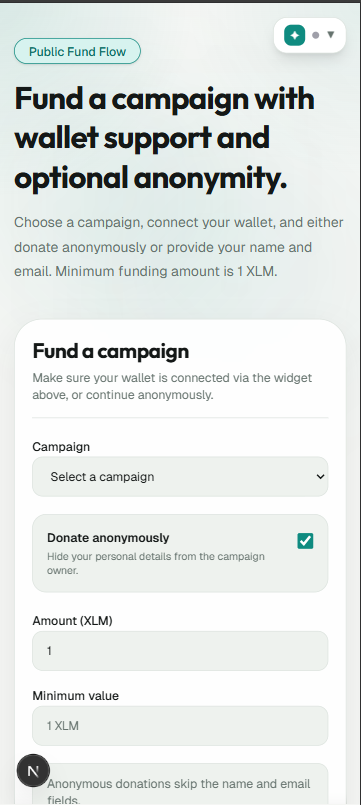
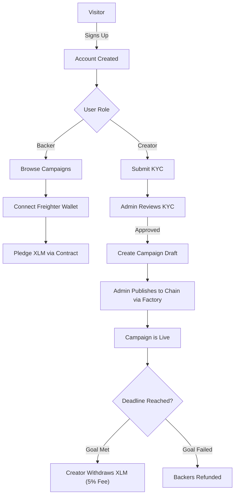
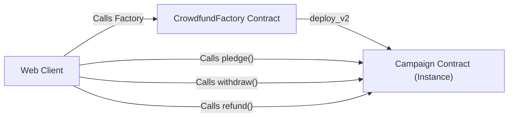
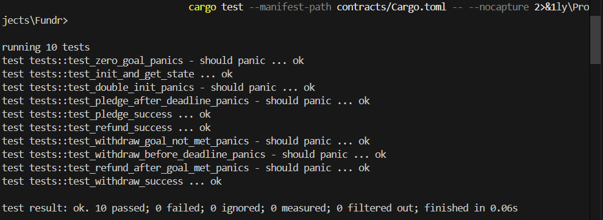

<p align="center">
  
</p>

<h1 align="center">Fundr</h1>

<p align="center">
  <i>A Decentralized, Transparent, and Secure Crowdfunding Platform built on Stellar Soroban.</i>
</p>

<p align="center">
  
  
  
  
  
  
</p>

---

### 🟢 Live Production Link: [https://fundr-green.vercel.app](https://fundr-green.vercel.app)

---

## 📖 About the Project

**Fundr** is a next-generation decentralized crowdfunding platform designed to eliminate fraud, guarantee fund delivery, and provide unmatched transparency for charitable causes, startup ideas, and community projects.

By leveraging **Stellar's Soroban Smart Contracts**, Fundr ensures that backers' funds are held safely in a programmatic escrow and are only released to campaign creators if their funding goals are met. If a campaign fails to reach its goal by the deadline, backers can instantly withdraw their pledges, completely eliminating platform exit scams and traditional banking hold-ups.

### 🛡️ Impact, Security, and Transparency
*   **Trustless Escrow:** Funds are never held by an intermediary. They are secured directly within an on-chain smart contract.
*   **Guaranteed Refunds:** If a campaign misses its funding target, smart contract logic guarantees that backers can easily retrieve their XLM. No manual processing or chargebacks required.
*   **Immutable Goal Enforcement:** Campaign creators cannot alter their funding targets or deadlines once the campaign is deployed on-chain.
*   **KYC Identity Verification:** Creators undergo strict admin-approved KYC (Know Your Customer) reviews before they are permitted to deploy campaigns, protecting the platform from anonymous bad actors.
*   **Platform Sustainability:** A built-in 5% maintenance fee is automatically and transparently routed to the platform administrators during a successful withdrawal, aligning platform success with creator success.

---

## 📸 Screenshots

### Web Screens

#### Landing & Public Pages


#### Backer / Funder Experience


#### Creator Dashboard


#### Admin Panel


### Mobile Screens




---

## 💻 Tech Stack

| Category | Technology | Purpose |
| :--- | :--- | :--- |
| **Frontend Framework** | Next.js 14 (App Router) | React framework for SSR and optimized routing |
| **Styling** | Tailwind CSS & Vanilla CSS | Modern, responsive, and highly-customizable UI |
| **Backend & Auth** | Supabase | PostgreSQL database, Auth, RLS Policies, and Storage |
| **Smart Contracts** | Rust (Soroban) | Writing secure, fast, and lightweight blockchain logic |
| **Blockchain Integration** | `@stellar/stellar-sdk` & Freighter | Interacting with Horizon/Soroban RPC and signing transactions |
| **Deployment** | Vercel | Global edge network hosting for the frontend application |

---

## 🔗 Smart Contracts Deployed (Stellar Testnet)

The platform utilizes a Factory pattern to dynamically spawn isolated escrow contracts for each campaign.

| Contract Name | Contract ID (Testnet) | Verification Link |
| :--- | :--- | :--- |
| **Crowdfund Factory** | `CBCEVQXYDJXFW6PLP4BDHXBDSR7HPU6YBV6LPSGNKLLX2BKUV35PYTMU` | [Verify on Stellar Expert](https://stellar.expert/explorer/testnet/contract/CBCEVQXYDJXFW6PLP4BDHXBDSR7HPU6YBV6LPSGNKLLX2BKUV35PYTMU) |
| **Campaign Template** (Sample) | `CCJLG4SZUMZGZLOMVWFCPSB4BIPH6A2ZJBGFDEV6VABDWCNXWXNH37A7` | [Verify on Stellar Expert](https://stellar.expert/explorer/testnet/contract/CCJLG4SZUMZGZLOMVWFCPSB4BIPH6A2ZJBGFDEV6VABDWCNXWXNH37A7) |

*You can verify these addresses on [Stellar Expert Testnet](https://stellar.expert/explorer/testnet).*

---

## 📂 Clean File Architecture

```text
Fundr/
├── app/                      # Next.js App Router Pages
│   ├── (auth)/               # Login, Register, Forgot Password
│   ├── (protected)/          # Admin Dashboard, Creator Dashboard, KYC, Manage Campaigns
│   ├── campaigns/            # Public Campaign display pages
│   └── globals.css           # Global Tailwind and Design System Tokens
├── components/               # Reusable React Components
│   ├── admin/                # Admin specific tables and controls
│   ├── campaigns/            # Campaign cards, withdrawal buttons
│   ├── dashboard/            # Stat cards and dashboard tables
│   ├── fund/                 # Interactive funding forms
│   ├── layout/               # Navbars, Footers, and Protected Sidebars
│   └── ui/                   # Reusable base UI (Buttons, Tooltips, Verification tags)
├── contracts/                # Rust Smart Contracts
│   ├── campaign/             # Escrow and logic for individual campaigns
│   └── crowdfund-factory/    # Factory for dynamic campaign deployment
├── hooks/                    # Custom React Hooks
│   └── useSorobanIntegration.ts # Modularized Freighter and smart contract integration logic
├── lib/                      # Utilities and Integrations
│   └── stellar/              # Soroban SDK, Freighter wallet, and RPC wrappers
├── sql/                      # Supabase Database Migrations & RLS Policies
├── scripts/                  # Deployment & E2E Testing scripts
└── types/                    # TypeScript interfaces & Supabase DB Types
```

---

## 🔄 User Workflow & Architecture

### User Workflow


### Smart Contract Architecture


---

## ✨ Platform & Contract Features

| Layer | Feature | Description |
| :--- | :--- | :--- |
| **Frontend** | **Multi-Role Dashboards** | Distinct, secure routing and UI for Backers, Creators, and Admins. |
| **Frontend** | **Real-time Metrics** | Aggregates on-chain contributions and displays dynamic progress bars. |
| **Frontend** | **Modular Hooks** | Extracted Stellar and Freighter integrations into highly reusable React hooks (e.g. `useSorobanIntegration`). |
| **Backend** | **Admin KYC & Moderation** | Immutable KYC application flow with admin approval gates. |
| **Backend** | **Row Level Security (RLS)** | Strict PostgreSQL policies ensuring users can only modify their own data. |
| **Contract** | **Factory Deployment** | Uses `deploy_v2` to spawn isolated contract state for every single campaign. |
| **Contract** | **Trustless Escrow** | Smart contract securely holds XLM without central authority intervention. |
| **Contract** | **Conditional Withdrawals** | Creators can only withdraw if `pledged >= goal` and the deadline has passed. |
| **Contract** | **Platform Fee Routing** | Hardcoded 5% network maintenance fee sent to the admin wallet on withdrawal. |

---

## 🚨 Error Handling

| Scenario | Handled By | User Feedback |
| :--- | :--- | :--- |
| **Wallet Not Installed** | Frontend Guard | "Freighter is not installed. Please install the extension." |
| **User rejects transaction** | Wallet Provider | Graceful catch displaying "Transaction rejected by user." |
| **Funding an expired campaign** | Smart Contract | Contract panics: `"campaign closed"`, bubbled up to UI. |
| **Withdrawing before deadline** | Smart Contract | Contract panics: `"campaign still active"`. |
| **Withdrawing below goal** | Smart Contract | Contract panics: `"goal not met, cannot withdraw"`. |
| **Invalid form inputs** | Server Actions / Zod | Inline red text displaying exact validation errors. |

---

## 🧪 Test Results & Evidence

The platform's critical functionality is thoroughly tested via automated Node E2E scripts and Rust contract unit tests.

### Smart Contract Test Verification



### Frontend E2E Route Verification


---

## ✅ Submission Verification Checklist

| Level | Criteria | Status |
| :--- | :--- | :---: |
| **Level 1** | Wallet connect / disconnect | ✅ |
| **Level 1** | Balance display | ✅ |
| **Level 1** | Send XLM transaction | ✅ |
| **Level 1** | Transaction feedback | ✅ |
| **Level 1** | 3+ error types handled | ✅ |
| **Level 2** | Smart contracts deployed on Testnet | ✅ |
| **Level 2** | Contract calls working (Factory, Pledging, Withdrawal, Refund) | ✅ |
| **Level 2** | Multi-wallet support (Freighter) | ✅ |
| **Level 2** | Real-time on-chain status | ✅ |
| **Level 3** | Inter-contract calls (Factory → Campaign `deploy_v2`) | ✅ |
| **Level 3** | E2E route & contract tests passing | ✅ |
| **Level 3** | Mobile responsive | ✅ |
| **Level 3** | Application live on Vercel | ✅ |
| **Submission** | Complete README with architecture | ✅ |
| **Submission** | Contract addresses documented with Tx links | ✅ |
| **Submission** | Contracts test done and added | ✅ |

---

## 🛠️ Project Setup Guide

### 1. Database Setup
1. Create a project on [Supabase](https://supabase.com).
2. Navigate to the SQL Editor and run the complete schema script:
   ```bash
   cat sql/full_schema.sql | # Execute this entire file in the Supabase SQL editor
   ```

### 2. Smart Contract Deployment
To build and deploy the contracts locally to Testnet:
```bash
# Compile contracts
soroban contract build

# Run deployment script
node scripts/deploy-contracts.mjs
```
*Note: Make sure to update your `.env.local` with the new Contract IDs.*

### 3. Frontend Setup
1. Clone the repository and install dependencies:
   ```bash
   npm install
   ```
2. Create a `.env.local` file based on `.env.example` and fill in your Supabase and Stellar credentials.
3. Start the development server:
   ```bash
   npm run dev
   ```

---

<p align="center">
  <b>Built with ❤️ for the Stellar Ecosystem.</b><br/>
  Thank you for reviewing the Fundr Project!
</p>
