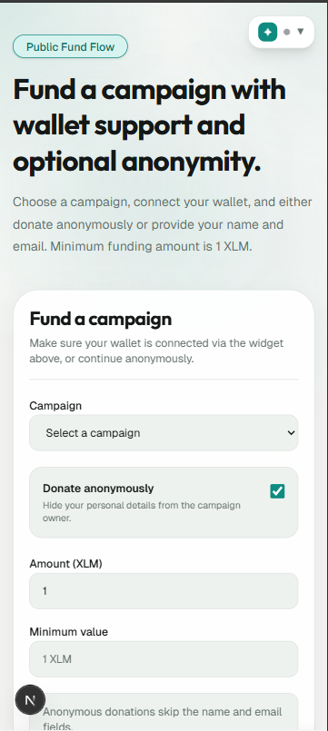
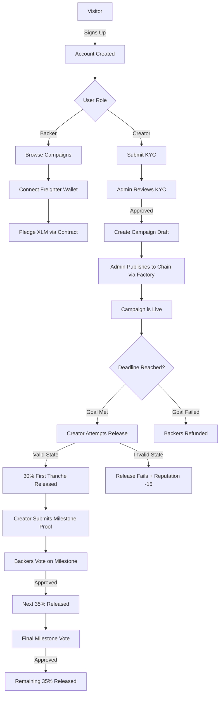
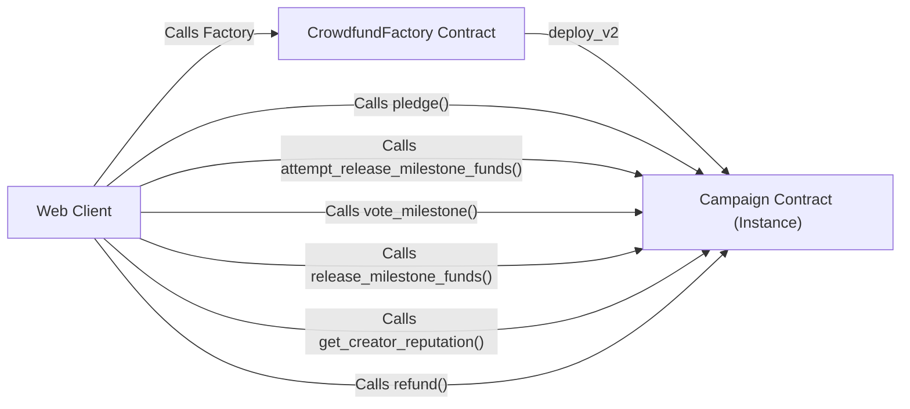
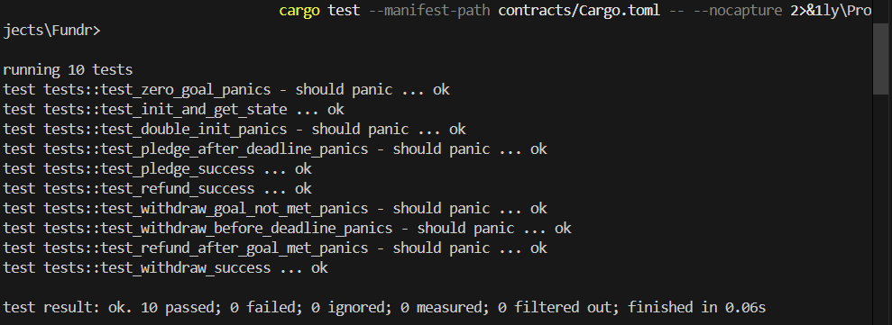

<p align="center">
  
</p>

<h1 align="center">Fundr</h1>

<p align="center">
  <i>A Decentralized, Transparent, and Secure Crowdfunding Platform built on Stellar Soroban.</i>
</p>

<p align="center">
  
  
  
  
  
  
</p>

---

### 🟢 Live Production Link: [https://fundr-green.vercel.app](https://fundr-green.vercel.app)
### ▶️ Youtube Video Link : [https://youtu.be/81VFHshgxiw](https://youtu.be/81VFHshgxiw)

---

## 📖 About the Project

**Fundr** is a next-generation decentralized crowdfunding platform designed to eliminate fraud, guarantee fund delivery, and provide unmatched transparency for charitable causes, startup ideas, and community projects.

By leveraging **Stellar's Soroban Smart Contracts**, Fundr ensures that backers' funds are held safely in a programmatic escrow and are released to campaign creators in milestone-based tranches after a successful campaign. If a campaign fails to reach its goal by the deadline, backers can instantly withdraw their pledges, completely eliminating platform exit scams and traditional banking hold-ups.

### 🛡️ Impact, Security, and Transparency
*   **Trustless Escrow:** Funds are never held by an intermediary. They are secured directly within an on-chain smart contract.
*   **Guaranteed Refunds:** If a campaign misses its funding target, smart contract logic guarantees that backers can easily retrieve their XLM. No manual processing or chargebacks required.
*   **Immutable Goal Enforcement:** Campaign creators cannot alter their funding targets or deadlines once the campaign is deployed on-chain.
*   **Milestone-Based Fund Release:** Successful campaigns no longer release 100% immediately. The creator receives an initial 30% tranche, then backers vote on milestone proof before the next 35% and final 35% are released.
*   **Backer Voting:** Milestone approval is pledge-weighted and enforced by the smart contract. Only real backers can vote, and each backer can vote once per milestone.
*   **KYC Identity Verification:** Creators undergo strict admin-approved KYC (Know Your Customer) reviews before they are permitted to deploy campaigns, protecting the platform from anonymous bad actors.

---

## 📸 Screenshots

### Web Screens

#### Landing & Public Pages


#### Backer / Funder Experience


#### Creator Dashboard


#### Admin Panel


### Mobile Screens




---

## 💻 Tech Stack

| Category | Technology | Purpose |
| :--- | :--- | :--- |
| **Frontend Framework** | Next.js 16 (App Router) | React framework for SSR and optimized routing |
| **Styling** | Tailwind CSS & Vanilla CSS | Modern, responsive, and highly-customizable UI |
| **Backend & Auth** | Supabase | PostgreSQL database, Auth, RLS Policies, and Storage |
| **Smart Contracts** | Rust (Soroban) | Writing secure, fast, and lightweight blockchain logic |
| **Blockchain Integration** | `@stellar/stellar-sdk` & Freighter | Interacting with Horizon/Soroban RPC and signing transactions |
| **Deployment** | Vercel | Global edge network hosting for the frontend application |

---

## 🔗 Smart Contracts Deployed (Stellar Testnet)

The platform utilizes a Factory pattern to dynamically spawn isolated escrow contracts for each campaign. The latest Testnet deployment includes the milestone-based campaign WASM that supports tranche release and backer voting.

### Latest Testnet Deployment

| Item | Value |
| :--- | :--- |
| **Network** | Stellar Testnet |
| **Crowdfund Factory Contract ID** | `CDG7F5LOLHGA3OCFQNYGBUSCJ7UC22JSSKPX5PM752TJ2BTTBVRGY27E` |
| **Campaign WASM Hash** | `b763f64a39de18f9ff3a90e454dc5aed2a9c00ab289558ec62598a89e7a3d02b` |
| **Deployer Wallet** | `GDRHEIIOD4PZ4CQEZN5QLMZTVA5QEZWX2OBSQMVSFLYICDJH3FXLKX3Y` |

Verification links:

*   [Verify latest factory contract on Stellar Expert](https://stellar.expert/explorer/testnet/contract/CDG7F5LOLHGA3OCFQNYGBUSCJ7UC22JSSKPX5PM752TJ2BTTBVRGY27E)

Latest campaign WASM exported functions:

```text
attempt_release_milestone_funds
get_milestone_state
get_creator_reputation
get_state
init
pledge
record_failed_withdrawal_attempt
refund
release_milestone_funds
report_fraud
vote_milestone
withdraw
```

Important deployment note: existing campaign contracts already deployed before this upgrade still use their original on-chain logic. New campaigns created through the latest factory use the milestone-based campaign WASM above, including on-chain creator reputation updates.

Health check note: the deployment completed successfully and the contract-live, `get_campaign`, `create_campaign` ABI, RPC health, and Horizon checks all passed.

---

## Latest Changes

The latest update replaces the old full-withdrawal model with milestone-based fund release:

*   `withdraw()` now releases only the first 30% tranche after a successful campaign.
*   `attempt_release_milestone_funds()` lets the creator attempt releases via dashboard flow; failed attempts return `0` and apply the on-chain `-15` reputation penalty.
*   `vote_milestone(backer, milestone, approve)` lets backers approve or reject milestone 1 and milestone 2.
*   `release_milestone_funds()` releases the next eligible tranche:
    *   first call releases 30%;
    *   after milestone 1 approval, the next call releases 35%;
    *   after milestone 2 approval, the final call releases the remaining 35%.
*   `milestone_1_completed` and `milestone_2_completed` are stored on-chain.
*   `get_milestone_state()` exposes milestone completion and yes-vote totals.
*   `get_creator_reputation()` exposes the on-chain reputation score used by the campaign page.
*   The creator dashboard now shows "Release Next Tranche" instead of full withdrawal.
*   Public campaign pages now include milestone voting controls for ended, fully funded campaigns.

Verification completed after this update:

```bash
npm run lint
npm run test:e2e
npx tsc --noEmit
npm run build
npm run deploy:stellar
cargo test --all
cargo clippy --target wasm32-unknown-unknown --release --lib -- -D warnings
docker compose config
```

Result: frontend lint passed, TypeScript typecheck passed, Playwright E2E completed (all 4 tests skipped in the local environment), production build passed, contract tests passed (`15 passed`), clippy passed, Docker Compose config parsed successfully, and the latest milestone contract WASM was redeployed to Stellar Testnet.

---

## 📂 Clean File Architecture

```text
Fundr/
├── app/                      # Next.js App Router Pages
│   ├── (auth)/               # Login, Register, Forgot Password
│   ├── (protected)/          # Admin Dashboard, Creator Dashboard, KYC, Manage Campaigns
│   ├── campaigns/            # Public Campaign display pages
│   └── globals.css           # Global Tailwind and Design System Tokens
├── components/               # Reusable React Components
│   ├── admin/                # Admin specific tables and controls
│   ├── campaigns/            # Campaign cards, withdrawal buttons
│   ├── dashboard/            # Stat cards and dashboard tables
│   ├── fund/                 # Interactive funding forms
│   ├── layout/               # Navbars, Footers, and Protected Sidebars
│   └── ui/                   # Reusable base UI (Buttons, Tooltips, Verification tags)
├── contracts/                # Rust Smart Contracts
│   ├── campaign/             # Escrow and logic for individual campaigns
│   └── crowdfund-factory/    # Factory for dynamic campaign deployment
├── hooks/                    # Custom React Hooks
│   └── useSorobanIntegration.ts # Modularized Freighter and smart contract integration logic
├── lib/                      # Utilities and Integrations
│   ├── stellar/              # Soroban SDK, Freighter wallet, and RPC wrappers
│   │   └── reputation.ts     # Server-side on-chain creator reputation reader
│   └── supabase/             # Supabase client/server/middleware utilities
├── sql/                      # Supabase Database Migrations & RLS Policies
├── scripts/                  # Deployment, health checks, and E2E scripts
│   └── stellar/              # Contract deploy and health-check scripts
└── types/                    # TypeScript interfaces & Supabase DB Types
```

---

## 🔄 User Workflow & Architecture

### User Workflow

```mermaid
graph TD;
    A[Visitor] -->|Signs Up| B["Account Created"];
    B --> C{User Role};
    C -->|Backer| D["Browse Campaigns"];
    D --> E["Connect Freighter Wallet"];
    E --> F["Pledge XLM via Contract"];
    
    C -->|Creator| G["Submit KYC"];
    G --> H["Admin Reviews KYC"];
    H -->|Approved| I["Create Campaign Draft"];
    I --> J["Admin Publishes to Chain via Factory"];
    J --> K["Campaign is Live"];
    
    K --> L{Deadline Reached?};
    L -->|Goal Met| M["Creator Attempts Release"];
    M -->|Valid State| N1["30% First Tranche Released"];
    M -->|Invalid State| N2["Release Fails + Reputation -15"];
    N1 --> O["Creator Submits Milestone Proof"];
    O --> P["Backers Vote on Milestone"];
    P -->|Approved| Q["Next 35% Released"];
    Q --> R["Final Milestone Vote"];
    R -->|Approved| S["Remaining 35% Released"];
    L -->|Goal Failed| T["Backers Refunded"];
```

### Smart Contract Architecture

```mermaid
graph LR;
    A["Web Client"] -->|Calls Factory| B["CrowdfundFactory Contract"];
    B -->|deploy_v2| C["Campaign Contract (Instance)"];
    A -->|"Calls pledge()"| C;
  A -->|"Calls attempt_release_milestone_funds()"| C;
    A -->|"Calls vote_milestone()"| C;
    A -->|"Calls release_milestone_funds()"| C;
  A -->|"Calls get_creator_reputation()"| C;
    A -->|"Calls refund()"| C;
```

---

## ✨ Platform & Contract Features

| Layer | Feature | Description |
| :--- | :--- | :--- |
| **Frontend** | **Multi-Role Dashboards** | Distinct, secure routing and UI for Backers, Creators, and Admins. |
| **Frontend** | **Real-time Metrics** | Aggregates on-chain contributions and displays dynamic progress bars. |
| **Frontend** | **Modular Hooks** | Extracted Stellar and Freighter integrations into highly reusable React hooks (e.g. `useSorobanIntegration`). |
| **Backend** | **Admin KYC & Moderation** | Immutable KYC application flow with admin approval gates. |
| **Backend** | **Row Level Security (RLS)** | Strict PostgreSQL policies ensuring users can only modify their own data. |
| **Contract** | **Factory Deployment** | Uses `deploy_v2` to spawn isolated contract state for every single campaign. |
| **Contract** | **Trustless Escrow** | Smart contract securely holds XLM without central authority intervention. |
| **Contract** | **Milestone-Based Release** | Successful campaigns release 30% first, 35% after milestone 1 approval, and the remaining 35% after milestone 2 approval. |
| **Contract** | **Backer Voting** | `vote_milestone()` allows only real backers to vote once per milestone, with voting power based on pledge amount. |
| **Contract** | **Conditional Releases** | Creators can only release funds if `pledged >= goal`, the deadline has passed, and milestone approvals are satisfied. |

---

## 🐳 Docker

Use the included multi-stage image for local runs. For safety, keep secrets in `.env.local` and never commit that file.

1. Start from the template:

```bash
cp .env.example .env.local
```

2. Fill in the values you need in `.env.local`.

3. Start the app:

```bash
docker compose up --build
```

The app will be available on [http://localhost:3000](http://localhost:3000). The compose file loads `.env.local`, so any Supabase or Stellar variables you already use locally will be passed into the container.

If you prefer a raw image build, use:

```bash
docker build -t fundr .
docker run --rm -p 3000:3000 --env-file .env.local fundr
```

If you are sharing the project, commit only `.env.example`, not `.env.local` or any other local env file.

---

## ⭐ Creator Reputation

Fundr now stores creator reputation on-chain in the campaign contract.

Formula:

```text
+10 Successful Campaign
+2 Goal Reached
-15 Failed Withdrawal Attempt
-20 Fraud Report
```

The public campaign page shows the current score and a trusted badge when the on-chain score is strong enough.

Failed creator release attempts now apply the `-15` penalty on-chain through the creator dashboard's release action.

---

## 🚨 Error Handling

| Scenario | Handled By | User Feedback |
| :--- | :--- | :--- |
| **Wallet Not Installed** | Frontend Guard | "Freighter is not installed. Please install the extension." |
| **User rejects transaction** | Wallet Provider | Graceful catch displaying "Transaction rejected by user." |
| **Funding an expired campaign** | Smart Contract | Contract panics: `"campaign closed"`, bubbled up to UI. |
| **Releasing before deadline** | Smart Contract | Contract panics: `"campaign still active"`. |
| **Releasing below goal** | Smart Contract | Contract panics: `"goal not met, cannot withdraw"`. |
| **Milestone release without approval** | Smart Contract | Contract panics: `"milestone not approved"`. |
| **Duplicate milestone vote** | Smart Contract | Contract panics: `"backer already voted"`. |
| **Non-backer milestone vote** | Smart Contract | Contract panics: `"only backers can vote"`. |
| **Invalid form inputs** | Server Actions / Zod | Inline red text displaying exact validation errors. |

---

## 🧪 Test Results & Evidence

The platform's critical functionality is thoroughly tested via automated Node E2E scripts and Rust contract unit tests.

### Smart Contract Test Verification



### Frontend E2E Route Verification


---


## 🛠️ Project Setup Guide

### 1. Database Setup
1. Create a project on [Supabase](https://supabase.com).
2. Navigate to the SQL Editor and run the complete schema script:
   ```bash
   cat sql/full_schema.sql | # Execute this entire file in the Supabase SQL editor
   ```

### 2. Smart Contract Deployment
To build and deploy the contracts locally to Testnet:
```bash
npm run deploy:stellar
```
*Note: The deploy script updates `.env.local` with the new factory contract ID and validates the deployment health checks.*

### 3. Frontend Setup
1. Clone the repository and install dependencies:
   ```bash
  npm ci
   ```
2. Create a `.env.local` file based on `.env.example` and fill in your Supabase and Stellar credentials.
3. Start the development server:
   ```bash
   npm run dev
   ```

---

<p align="center">
  <b>Built with ❤️ for the Stellar Ecosystem.</b><br/>
  Thank you for reviewing the Fundr Project!
</p>
